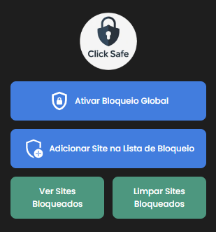

#  Click Safe Popup Blocker




**Click Safe Popup Blocker** é uma extensão para navegadores baseados em Chromium que impede que novas janelas e abas sejam abertas sem o consentimento do usuário. Ela garante que os sites só possam abrir novas abas ou janelas quando o usuário optar explicitamente por isso, ao clicar com o botão direito e selecionar "Abrir link em uma nova guia".

## 🛠 Funcionalidades

- **Bloqueio global de popups:** Ative ou desative o bloqueio de popups em todos os sites com um clique.
- **Lista personalizada de bloqueio:** Adicione ou remova sites da lista de bloqueio conforme sua preferência.
- **Controle granular:** Permite bloquear automaticamente novas abas ou janelas, exceto quando o usuário escolhe abrir manualmente.
- **Interface simples e intuitiva:** Fácil de usar com botões no popup da extensão para gerenciar o bloqueio.

## 🚀 Instalação

1. Clone este repositório:

   ```bash
   git clone https://github.com/gabrielsouzas/click-safe-popup-blocker.git
   ```

2. Abra o Chrome e vá para a página de extensões:

   ```bash
   chrome://extensions/
   ```

3. Ative o modo Desenvolvedor no canto superior direito.

4. Clique em Carregar sem compactação e selecione a pasta do repositório clonado.

## 📦 Como Usar

1. **Ativar/desativar bloqueio global**: Abra o popup da extensão e clique no botão "Ativar Bloqueio Global" para bloquear popups em todos os sites.

2. **Adicionar/remover sites à lista de bloqueio**: No popup, clique em "Adicionar Site à Lista de Bloqueio" para incluir o site atual na lista de bloqueio, ou clique em "Remover Site da Lista de Bloqueio" para removê-lo.

3. **Ver sites bloqueados**: Clique no botão "Ver Sites Bloqueados" para ver a lista dos sites onde o bloqueio está ativo.

## 👤 Autor

Feito por Gabriel Souza - Sinta-se à vontade para entrar em contato!

Divirta-se navegando com segurança com o Click Safe Popup Blocker!
